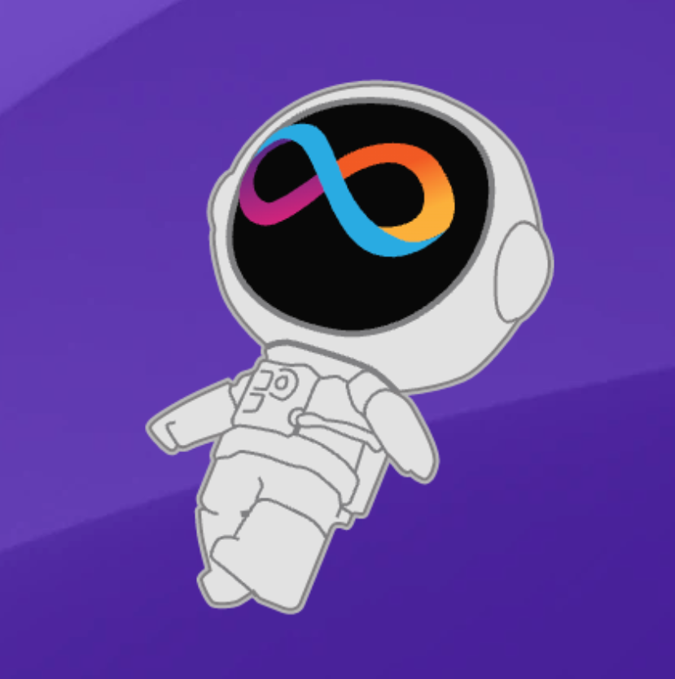
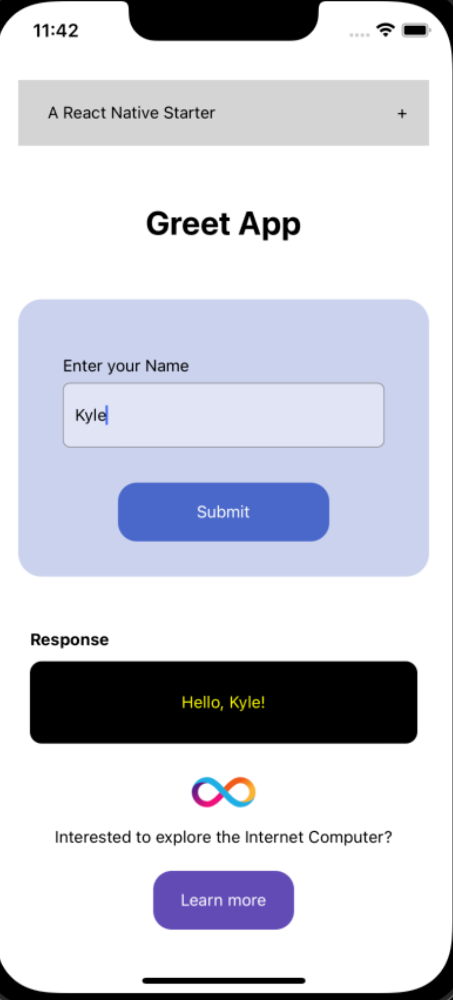
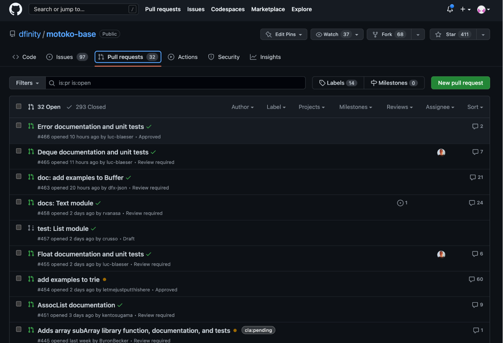
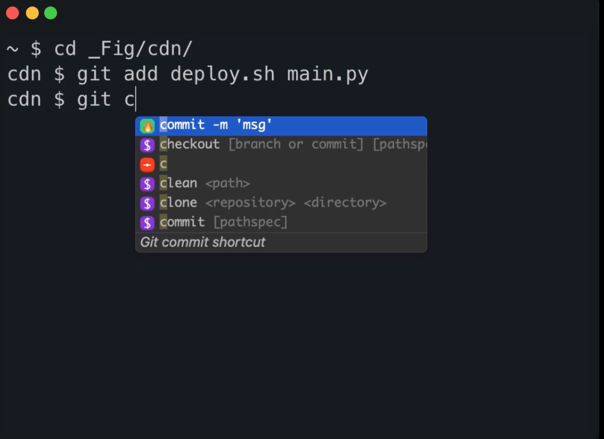

# SDK & Motoko – Weekly Update Part 3!!

Hello Devs,

We’re back with a third weekly update to keep you guys in sync with what we’re working on for Motoko and the Internet
Computer SDK. You can check out our previous
post [here](https://forum.dfinity.org/t/generational-gc-on-playground-and-new-async-await-weekly-motoko-updates/17270).

## Embed Motoko: Interactive code snippets directly in your Medium story or blog post!

We are excited to announce a new collaboration which brings
runnable [Motoko code snippets](https://embed.smartcontracts.org/) directly into the [Medium](https://medium.com/)
social publishing platform.
As a part of an ongoing effort to overhaul Motoko’s documentation, we wanted to make it easy for anyone in the IC
community to create interactive tutorials and code examples across the Internet.
You can see the full
post [here](https://forum.dfinity.org/t/embed-motoko-interactive-code-snippets-directly-in-your-medium-story-or-blog-post/17433).

## React Native <-> Internet Computer

React Native is a popular open-source framework that allows developers to build native mobile applications using
JavaScript and React. With React Native, developers can create high-quality, cross-platform apps that feel and perform
like native apps, without the need to maintain separate codebases for each platform.

Up until now, React Native had limited support for the necessary APIs to perform cryptographic computations in
JavaScript. With the release of BigInt support however, it is now possible to build and deploy mobile apps that
communicate directly with the Internet Computer!

We have a starter template available for you here that uses agent-js (0.15) with no patches necessary! Check it out and
let us know what you think! Looking forward to seeing what you build.

## Improvements Coming to Base Library Documentation

The team has been hard at work adding tests, documentation, and examples to the Base Library. We now have nearly 10 PRs
open that each add significant coverage!

The community has been asking for improvements in this regard for some time, and we know it’s one area that has been
starved of attention for a while. Personally, I’m excited to see live code snippets alongside every block of
documentation that can be edited in real time. I hope that you will accept this as a small token of our appreciation (
and perhaps a holiday gift) for being the best developer community in the world.

Hats off to everyone involved for their tireless efforts.

If you’re interested in contributing, please do! We have instructions for how to get your machine set up to run the
Motoko compiler and base library documentation
project [here](https://dirt-jaguar-6a2.notion.site/How-to-contribute-to-the-base-examples-d2761b204d5443d6b170d0dfe6a70591).
You can find the base library on GitHub [here](https://github.com/dfinity/motoko-base).

## App of the Week: Fig

Fig is an application that lets you add visual autocomplete to any CLI tool or script. Some of us on the team have been
using it for several weeks now, and it’s offered a nice boost to productivity. It’s like an OS for your terminal.

Here are the top three things we love about it:

dropdown command menu for CLI’s
Consolidation of aliases and personal utility scripts
`fig ai` - translate natural language into bash commands

and much much more.

You can download Fig [here](https://fig.io/).

# See you next time!

We'll be back with more features and updates :slight_smile:

– DFINITY Languages team.

