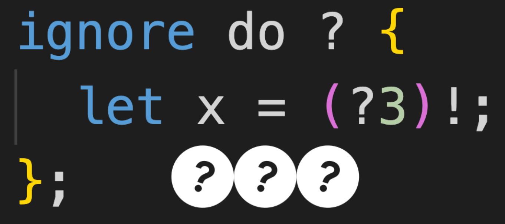

# Motoko Weekly Update Part 5!


Hey Motoko Devs,

If you missed the last update post from the Motoko team, check it
out [here](https://forum.dfinity.org/t/timers-and-base-library-weekly-motoko-updates/18063). The post included updates
about the new Motoko Timers language features as well as continued base library documentation and testing efforts.

It’s a light week this week from the languages team!

## Motoko package management planning


There are currently discussions about what the future of Motoko package management looks like with respect to Vessel and
other package management tools that the community is using, such as [MOPS](https://mops.one/). There was a nice post by
@icme recently talking about this issue that can be found
here: https://forum.dfinity.org/t/developer-feedback-opportunity-motoko-package-manager-improvements-redesign/18137

You can expect to see changes in the future coming to this aspect of the Motoko dev experience, so please weigh in and
comment on the thread with your thoughts on package management in Motoko!

## Using Blocks in Motoko



This is not a new feature update, but as it is a light week, I thought it might be helpful to cover some existing
language features that might be less known to new developers. Apologies if you’re an experienced Motoko user and this is
old news to you :)

There’s a notion in Motoko of a “block” (found in many languages) that can be thought of as a sequence of statements (
such as assignments, declarations, function calls, etc.). The most common places where you find a block is as the two
bodies of an `if` expression, the body of a `while` loop, or a function body.

```
while (x < 3) {
  // this is a block
}
```

I assume this is not news to many people.

Some interesting things to note about this construct is that blocks in Motoko can also be thought of as expressions (in
addition to being sequences of statements). While a statement is a language construct that produces some effect (like
calling a function or declaring a variable), an expression is a construct that can evaluate to some value (such as “2”
or “2 + 3” or “foo()”). In the case of a `do` block, the block expression evaluates to the last expression in the block.
This means you can bind `do` blocks to variables!

```
let x = do {
  foo();
  bar();
  3
};
// the value of x here is 3
```

This is also how you can bind to an `if` expression.

```
let x = 
  if (y < 0) {
    foo();
    2
  } else {
    bar();
    3
  };
// the value of x here is either 2 or 3, and either foo() or bar() was called depending on y
```

You can even bind a variable to a `while` loop, but that is less useful, because the body of a while loop is forced by
the type system to always evaluate to unit.

```
let x = 
  while (y < 0) {
    foo();
  };
// x always evaluates to ()
```

I mentioned before that function bodies are also blocks. This means that you don’t actually have to use the `return`
keyword to finish a function, unless you want to exit the function early.

```
func foo() : Nat {
  bar1();
  bar2();
  3 // the function returns 3 because the value of the block gets evaluated to the value 3
}
```

You can also add a `?` to the `do` block to work with option types.

```
let x : ?Nat = foo(); // x is an option type who may or may not be null
let y = 
  do ? {
    x! + 3
  };
```

If `x` was null, then the entire `do ? {}` block evaluates to null when `x` is examined by the `!` operator. Thus, `y`
is also null. However, if `x` had some Nat value, the value is added to 3, wrapped in an option type, and assigned
to `y`!

This is also useful in conjunction with the `ignore` keyword to perform a side effect that might involve intermediate
option types.

```
ignore do ? {
  let x = foo()!;
  let y = bar(x)!;
  Debug.print(baz(z)!);
};
```

Assuming `foo()`, `bar()`, and `baz()` all return an option type to signal success or failure, you can chain these
functions and have the whole block abort as soon as any of the individual functions abort. Whatever happens in
the `do ? {}` block, the value that the block evaluates to is ignored, and the program continues onward.

# See you next time!

See you guys next week!

– DFINITY Languages team.
